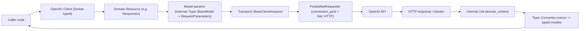
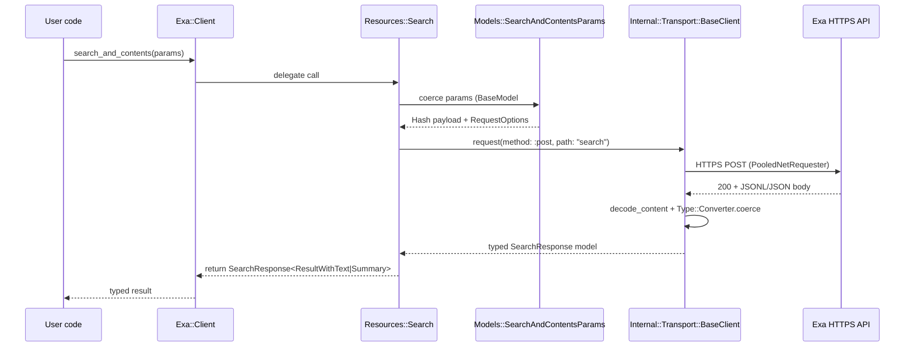
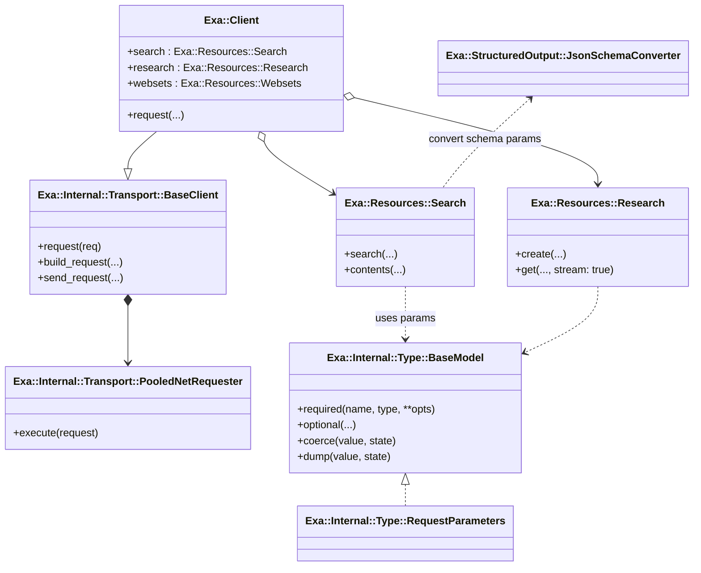

# Exa Ruby Client Architecture Notes

## Goals
- Deliver a v1 Exa Ruby client whose ergonomics mirror `openai-ruby`, so Sorbet-aware developers get typed resources, model structs, and helpful helpers out of the box.
- Reuse the architectural patterns from `openai-ruby` (transport, internal type system, structured-output DSL, streaming/pagination helpers) instead of reinventing request/response plumbing.
- Understand Exa's API surface (search, contents, answers, research, websets, monitors, etc.) plus their JSON-schema-driven endpoints to inform a phased implementation plan. Future v2 work will plug in `dspy-schema`-derived Sorbet types for schema-heavy endpoints.

## Reference Implementations Studied
- `openai-ruby/openai.gemspec` limits runtime dependencies to `connection_pool` and requires Ruby 3.2+. Everything else (Sorbet RBI, SIGs, manifests) ships inside the gem for repeatable builds.
- `openai-ruby/lib/**`: transport (`Internal::Transport`), the `Internal::Type` system, resource wrappers, structured output helpers, streaming/pagination mixins, plus thousands of generated model classes.
- `exa-py`: imperative Python client with camelCase ↔ snake_case converters, `requests`/`httpx`, schema helpers, OpenAI tool-call bridge, research + websets sub-clients.
- `exa-js`: TypeScript SDK using `fetch`, Zod-powered schema inference (`zodToJsonSchema`), streaming Research API helpers, and similar endpoint coverage.
- `openapi-spec/exa-openapi-spec.yaml` & `exa-websets-spec.yaml`: canonical endpoint/shape definitions (search, findSimilar, getContents, answer, research CRUD/streaming, websets, monitors, imports, events, webhooks, etc.).

## openai-ruby Architecture Highlights
### Packaging & entrypoint
- `openai.gemspec` (openai-ruby/openai.gemspec) exposes only runtime essentials: it ships `lib`, Sorbet `rbi`/`sig`, `manifest.yaml`, docs, and depends solely on `connection_pool`.
- `lib/openai.rb` loads standard libs (`net/http`, `uri`, `stringio`, etc.), guards against unwanted Tapioca runs, pulls in all internal modules, helpers, models, and resource namespaces so `require "openai"` gives a fully wired client.

### Internal transport stack
- `OpenAI::Client` (`lib/openai/client.rb`) inherits from `OpenAI::Internal::Transport::BaseClient` to inherit retry/backoff/timeouts, HTTP build logic, and streaming/page helpers. It instantiates resource singletons (`@chat`, `@responses`, `@batches`, etc.) that users call.
- `BaseClient` (`lib/openai/internal/transport/base_client.rb`) handles:
  - Request validation and normalization, building URLs + headers (injecting `PLATFORM_HEADERS`), and merging `RequestOptions`.
  - `send_request` with redirect following, exponential backoff, header-based retry hints, and SSE/JSON/JSONL decoding via `OpenAI::Internal::Util.decode_content`.
  - Automatic conversion of decoded payloads into typed models via `OpenAI::Internal::Type::Converter.coerce`, or instantiating `BaseStream`/`BasePage` subclasses when `stream`/`page` is provided.
- `PooledNetRequester` (`lib/openai/internal/transport/pooled_net_requester.rb`) wraps `Net::HTTP` with `connection_pool` to reuse sockets per origin, calibrates socket timeouts from deadlines, builds chunked requests for IO/StringIO bodies, and exposes a fused enumerator that yields `[request, response]` followed by streaming chunks.

### Type system & FP-inspired patterns
- `OpenAI::Internal::Type::BaseModel` (`lib/openai/internal/type/base_model.rb`) is the backbone for request/response structs:
  - `required`/`optional` DSL adds fields with metadata (`api_name`, `const`, `nil?`, `enum`, etc.) while storing lambdas that lazily resolve nested converters.
  - `request_only`/`response_only` scopes toggle whether attributes participate when dumping vs coercing.
  - Accessors eagerly coerce on assignment, but getters re-coerce lazily and raise `ConversionError` with context if something is invalid—useful for generated Sorbet sigs.
  - `coerce` uses Ruby 3 pattern matching with destructuring to walk hashes, track `exactness` stats, and preserve unknown keys (mirrors Rust's `match` + `Result` semantics).
- `OpenAI::Internal::Type::Converter` (`lib/openai/internal/type/converter.rb`) centralizes `coerce`/`dump` behaviour for `BaseModel`, `ArrayOf`, `HashOf`, `Union`, `Boolean`, etc., tracking `strictness` and `exactness` to choose viable union variants (very similar to Rust enums).
- Collection helpers like `ArrayOf`/`HashOf` (files under `lib/openai/internal/type`) behave like typed `Vec`/`HashMap`, with nilable support and Sorbet type reflection (`to_sorbet_type`).
- `Union` implements tagged unions with discriminators, an optimisation path when the discriminator is present, and a fallback that ranks coercion candidates by `(yes, maybe, no)` counts—again mimicking Rust's enum pattern-matching.
- `OpenAI::Internal::Util` provides utility FP-style helpers:
  - `walk_namespaces(...).chain([ns])` (lines 17–27) relies on Ruby 3’s Enumerator#chain to lazily traverse constants.
  - `chain_fused`, `fused_enum`, and `decode_lines` (lines 669–779) reimplement Rust's `FusedIterator` concept for SSE/JSONL streaming. `chain_fused` ensures upstream enumerators are closed exactly once using `ensure`.
  - Frequent `Kernel.then` usage (e.g., `BaseClient#request` lines 404–407) mirrors `Option::map`, letting temporary values stay scoped while guaranteeing cleanup.

### Structured output & JSON schema
- `OpenAI::Helpers::StructuredOutput` (lib/openai/helpers/structured_output.rb) mirrors the `Internal::Type` DSL but narrowed to schema-safe building blocks (`Boolean`, `EnumOf`, `UnionOf`, `ArrayOf`, `BaseModel`).
- `JsonSchemaConverter` converts DSL-defined models into `$defs`-aware JSON Schemas, handles caching/inlining, and can union in `null` metadata. Helpers such as `to_nilable`, `assoc_meta!`, `cache_def!`, and `to_json_schema_inner` preserve references and metadata (lib/openai/helpers/structured_output/json_schema_converter.rb lines 6–198).
- `Chat::Completions` uses these converters in `get_structured_output_models` to transform DSL classes into the JSON payload OpenAI expects, and to parse tool call arguments back into typed structs.

### Request parameters, streaming, pagination
- `OpenAI::RequestOptions` (`lib/openai/request_options.rb`) is itself a `BaseModel` that validates per-request overrides and exposes a Sorbet alias for either the model or a plain hash.
- `Internal::Type::RequestParameters` mixin injects a `request_options` attribute into model classes and a helper to split the options hash from serialized params—useful for differentiating HTTP knobs from API payload.
- `Internal::Type::BaseStream` / `BasePage` define the protocol for streaming enumerables and auto-paging enumerators.
- `Internal::Util.decode_sse` reconstructs Server-Sent Events, feeding `BaseStream` enumerators with fused behaviour.

### Mermaid: Request Flow


## Exa API Surface & Existing Client Learnings
### REST endpoints (OpenAPI)
- Core search stack (`/search`, `/findSimilar`, `/contents`, `/answer`) plus embeddings-backed options like autoprompt, filters, autop summarization.
- Research endpoints (list/create/get/stream, `ResearchController_*`).
- Websets & monitors spec is large (`exa-websets-spec.yaml`): CRUD for websets, items, enrichments, events, monitors, monitor runs, imports, plus webhook management and searches scoped to websets.
- JSON schemas show camelCase fields (`numResults`, `includeDomains`, `outputSchema`, etc.) and nested objects for text/highlights/summary/context payloads.

### exa-py motifs
- `Exa` client (exa-py/exa_py/api.py) stores base headers, uses camel↔snake conversion helpers, and merges `requests` (sync) with `httpx` (async).
- `search_and_contents` overloads mirror OpenAI-style typed responses by returning Generic dataclasses (`SearchResponse[T]`).
- Structured summaries accept either dict schemas or `pydantic.BaseModel`, converted/inlined via `_convert_schema_input` with a custom `InlineJsonSchemaGenerator`.
- Research/Websets clients encapsulate domain-specific operations, matching what `OpenAI::Resources::*` does.
- Utility functions `maybe_get_query`, `add_message_to_messages`, and `ExaOpenAICompletion` integrate Exa search results with OpenAI chat completions/tool-calls—a hint that Exa Ruby should expose similar helpers.

### exa-js motifs
- Typescript types (`BaseSearchOptions`, `ContentsOptions`, etc.) map closely to OpenAPI definitions and show which fields are optional, enumerations, literal unions, etc.
- Uses `Zod` schemas to accept typed output schemas, then converts them via `zodToJsonSchema`.
- Research streaming uses `ReadableStream` readers to emit parsed events, similar to `BaseStream`.

### JSON schema handling
- Both Python and JS clients allow users to supply either schema objects or DSL models (Pydantic/Zod). Ruby v1 can start with plain hashes, but the architecture should make it easy to plug in Sorbet-backed schema modules (like `OpenAI::StructuredOutput` or the future `dspy-schema` gem) later.

## Functional Programming Patterns to Mirror
- **Pattern matching (`case/in`)** – heavy use across transport and type coercion to destructure tuples (`when [status, method]`, `in {response_format: ...}`). Ruby 3 pattern matching keeps code declarative (akin to Rust `match`).
- **`Kernel.then` + `Enumerator#chain`** – used for scoped transformations and lazy compositions (see `BaseClient#send_request` error decoding and `Util.walk_namespaces`).
- **Fused enumerators** – `Util.chain_fused`, `fused_enum`, `decode_lines`, `decode_sse` bring in Rust's iterator semantics and should be reused for SSE responses from Exa Research/Websets streaming endpoints.
- **Type-level combinators** – `ArrayOf`, `HashOf`, `Union`, `Enum` mimic algebraic data types; we can generate Sorbet-visible types for Exa responses the same way.
- **RequestOptions merging** – `BaseClient#build_request` deep-merges `extra_query`, `extra_headers`, `extra_body` similar to `HashMap` overlays.

## Sorbet-first alternative & JSON schema reuse
- If we prefer not to port `OpenAI::Internal::Type`, we can describe Exa requests/responses with Sorbet-native constructs (`T::Struct`, `T::Enum`, `T.type_alias`). This keeps types idiomatic and interoperable with other Sorbet code but requires a light serializer to translate prop names into the camelCase JSON payload and to strip nils.
- The JSON-schema exporter already exists in `../dspy.rb/lib/dspy/type_system/sorbet_json_schema.rb:1-210`. It handles enums, typed arrays/hashes, nilable unions, recursion guards, and auto-tags `_type` fields for unions. Extracting that module into a shared `dspy-schema` gem lets Exa Ruby accept Sorbet structs for structured outputs (e.g., `summary.schema`, Research `output_schema`) without inventing another converter.
- Trade-offs:
  - *Reuse OpenAI DSL*: immediate access to request-only/response-only metadata, built-in schema exporter, and proven coercion/streaming helpers—but introduces a second DSL for developers to learn.
  - *Sorbet-native structs*: tighter integration with Sorbet tooling, clearer RBI generation, and the ability to model higher-level unions (“search modes” that flip moderation/autoprompt flags). Requires us to: (1) rely on `sorbet-runtime` for input validation, (2) build a serializer + camelCase mapper, and (3) port pagination/stream helpers separately.
- Modeling complex option sets gets easier with Sorbet enums/unions: define `SearchType < T::Enum` for `"keyword" | "neural" | ...`, `ModerationMode` for booleans, and higher-level unions like `SearchMode = T.any(KeywordModerated, NeuralAutoPrompt, DeepExcludeSource)` where each struct computes the underlying flags (`type`, `moderation`, `use_autoprompt`, `exclude_source_domain`). Resources can accept either the raw structs or these mode objects and merge the resulting hashes before hitting the transport.
- Regardless of the path, we should extract dspy’s converter so both Exa Ruby and future `dspy-schema` consumers share the same Sorbet → JSON Schema pipeline.

## TDD plan for v1 (Minitest, no VCR)
1. **Bootstrapping tests**
   - Start with `test/exa_test.rb` (already in repo) to assert version presence and placeholder error class.
   - Add `test/support/openapi_helper.rb` that loads `../openapi-spec/exa-openapi-spec.yaml` so tests can validate schemas without HTTP calls.
2. **Transport contract**
   - Write failing Minitest for `Exa::Transport::BaseClient` covering:
     - building request URLs/headers (including `x-api-key`, `x-stainless-*` platform headers).
     - retry/backoff decisions using stubbed responders (no VCR; use `WEBrick`-less `StubServer` built with `TCPServer` or `Rack::MockRequest`).
   - Use dependency injection so tests feed a fake requester (no network). TDD order: interface test → fake requester returning canned responses → implementation.
3. **Type layer**
   - Decide Sorbet strategy (native structs vs OpenAI DSL). For Sorbet-native: create `test/models/search_request_test.rb` verifying:
     - enums reject invalid values (Sorbet runtime raises).
     - serializer maps `:num_results` → `numResults`, strips nils, merges `RequestOptions`.
   - Use OpenAPI helper to assert generated serializer keys match spec-defined schema.
4. **Resource modules**
   - For each endpoint bucket (Search, Contents, FindSimilar, Answer, Research):
     - Write request unit tests that instantiate params + call resource method with fake transport, asserting the HTTP method/path/body/headers match spec examples.
     - Write response-coercion tests that feed fixture JSON Hashes (taken from OpenAPI `examples` blocks) and assert strongly typed structs come back.
   - Sequence: Search (baseline) → Search+Contents (shared) → FindSimilar → Answer → Research (includes SSE stream test using enumerators).
5. **JSON schema integration**
   - After extracting dspy’s `SorbetJsonSchema`, add tests proving:
     - A Sorbet struct used in `summary.schema` converts to JSON Schema identical to the OpenAPI schema (via YAML diff).
     - Nilable + union cases produce `anyOf` / `oneOf` arrays the API accepts.
6. **End-to-end smoke tests (still unit-level)**
   - Build `test/client/search_contract_test.rb` that wires `Exa::Client` with the fake transport and ensures chaining `client.search.search` uses base URL + merges organization/project headers when set.
   - Similar top-level tests for Research streaming: ensure enumerator yields typed events and closes underlying IO.
7. **Tooling**
   - Use `rake test` as the single TDD entry point.
   - Keep tests deterministic by seeding random number generator where jitter/backoff is involved.
   - No VCR: all HTTP interactions stubbed via dependency injection or local `Rack::Test` apps referencing OpenAPI samples.

## Proposed Exa Ruby Client (v1) Plan
1. **Scaffold gem & namespaces**
   - Mirror openai-ruby’s structure: `lib/exa.rb` loads standard libs, `Exa::VERSION`, `Exa::Internal::*`.
   - Ship Sorbet RBI/SIG stubs just like OpenAI so editors get type info.
2. **Transport layer**
   - Copy/rename `Internal::Transport::BaseClient` and `PooledNetRequester` to `Exa::Internal::*`, updating default base URL (`https://api.exa.ai`), auth headers (`x-api-key`), and platform header prefix (still `x-stainless-*` unless rebranded).
   - Keep retry heuristics but tune defaults to Exa rate limits/timeouts (Exa search is typically faster; start with `timeout ~ 120s`, `max_retries 2`).
3. **Type system reuse**
   - Port `Internal::Type` modules verbatim into `Exa::Internal::Type` so we can generate model classes straight from the OpenAPI spec (same DSL, same Sorbet integration).
   - Use `request_only`/`response_only` + `api_name` metadata to map snake_case Ruby attribute names to Exa’s camelCase JSON keys (e.g., `optional :num_results, Integer, api_name: :numResults`).
4. **Resource modules**
   - Start with `Exa::Resources::Search`, `Contents`, `Answers`, `FindSimilar`, `Research`, `Websets`, `Monitors`, `Imports`, `Webhooks`. Each resource owns nested classes (e.g., `Exa::Resources::Search::Results`).
   - Implement method signatures referencing generated models, e.g. `Exa::Resources::Search#create(params : Exa::Models::SearchCreateParamsRequest)`.
   - Provide streaming variants returning subclasses of `Internal::Type::BaseStream` for SSE endpoints (Research, monitors, events).
5. **Model generation**
   - Use OpenAPI definitions to create `lib/exa/models/**/*.rb` (mirroring `openai-ruby/lib/openai/models`). Each schema becomes a `BaseModel` descendant with `required`/`optional` fields and nested unions/enums.
   - Include request parameter mixins where relevant (`include Exa::Internal::Type::RequestParameters`).
6. **Helper utilities**
   - Port `maybe_get_query`, `add_message_to_messages`, and `ExaOpenAICompletion` analogues so Ruby devs can integrate Exa search results into OpenAI chat completions or other tooling.
   - Provide camelCase ↔ snake_case helpers if ever needed, but lean on `api_name` metadata first.
7. **Testing & docs**
   - Document endpoints and typed parameters under `docs/` (this file is step zero).
   - Add basic integration specs that hit mock servers or VCR recordings, focusing on verifying coercion + streaming enumeration semantics.

### Mermaid: Sequence (Search & Contents)


### Mermaid: Class Relationships


## V2 Preview (dspy-schema Integration)
- Extract schema definitions from `dspy.rb` into a standalone `dspy-schema` gem that emits Sorbet types and JSON Schema metadata.
- Plug those schema classes into Exa endpoints that accept structured outputs (`summary.schema`, Research `outputSchema`). Because `BaseModel` already implements `JsonSchemaConverter`, the Exa client can expose helpers like `schema: Exa::StructuredOutput::SomeShape`.
- Expand structured output tests to ensure Sorbet + runtime validation stays accurate.

## Risks / Open Questions
- **Spec drift** – OpenAPI specs may lag behind production (same issue OpenAI solves with generated models). Build generation scripts so updating specs regenerates models/resources automatically.
- **Streaming differences** – Exa Research SSE payloads differ slightly from OpenAI's; verify that `decode_sse` covers their format or patch `Internal::Util` to match Exa's event framing.
- **Auth headers** – Confirm if Exa requires any request IDs/idempotency headers besides `x-api-key` to avoid 401s.
- **Error shapes** – Inspect Exa error envelopes to ensure `APIStatusError` equivalents expose `type`, `message`, `details`.
- **CamelCase surfaces** – Validate that `api_name` metadata fully covers Exa's JSON keys so we don't need runtime converters.
- **Versioning** – Decide whether to mirror OpenAI's `manifest.yaml` approach for reproducible packaging.

With these notes and diagrams, we have a clear map of what to port from `openai-ruby`, how Exa's APIs behave today, and which functional programming techniques make the client pleasant to use and easy to statically type with Sorbet. The next implementation task is to scaffold `Exa::Internal` modules and start generating model/resource classes directly from the OpenAPI specs.

### Conceptual Usage Examples (one per major endpoint)
> These examples illustrate the intended ergonomics of the future `exa-ruby` client. Method names mirror the Python/JS SDKs but leverage the Sorbet-typed resource objects described above.

```ruby
require "exa"

client = Exa::Client.new(api_key: ENV.fetch("EXA_API_KEY"))
```

- **Search** – lightweight keyword/neural query returning typed `Exa::Models::SearchResponse`:
  ```ruby
  response = client.search.search(
    query: "latest reasoning LLM papers",
    num_results: 5,
    include_domains: ["arxiv.org"]
  )
  response.results.each { puts _1.title }
  ```

- **Search + Contents** – same endpoint but requesting text snippets (maps to `/search` + contents block):
  ```ruby
  response = client.search.search_and_contents(
    query: "frontier model evals",
    text: {max_characters: 1_000, include_html_tags: false},
    summary: true,
    livecrawl: "fallback"
  )
  response.results.each { puts _1.text&.first&.text }
  ```

- **Find Similar** – nearest-neighbor lookup on a seed URL:
  ```ruby
  similar = client.search.find_similar(
    url: "https://example.com/blog/ai-security",
    num_results: 3,
    exclude_source_domain: true
  )
  similar.results.map(&:url)
  ```

- **Direct Contents** – fetch rich content for known URLs via `/contents`:
  ```ruby
  contents = client.search.contents(
    urls: ["https://docs.exa.ai/product"],
    text: true,
    highlights: {query: "evals", num_sentences: 2},
    summary: {schema: MySummarySchema} # accepts BaseModel/Sorbet DSL in v2
  )
  puts contents.results.first.summary&.summary
  ```

- **Answer** – use Exa’s answer endpoint with structured output:
  ```ruby
  answer = client.search.answer(
    query: "Who funds frontier AI labs?",
    summary: {schema: AnswerShape},
    search_options: {type: "deep", moderation: true}
  )
  puts answer.result.summary
  ```

- **Research (streaming or poll)** – long-running research tasks with SSE events:
  ```ruby
  research = client.research.create(
    instructions: "Map the top 5 robotics labs and their flagship projects",
    output_schema: ResearchShape
  )

  client.research.get(research.id, stream: true).each do |event|
    puts "[#{event.event_type}] #{event.payload.inspect}"
  end
  ```
